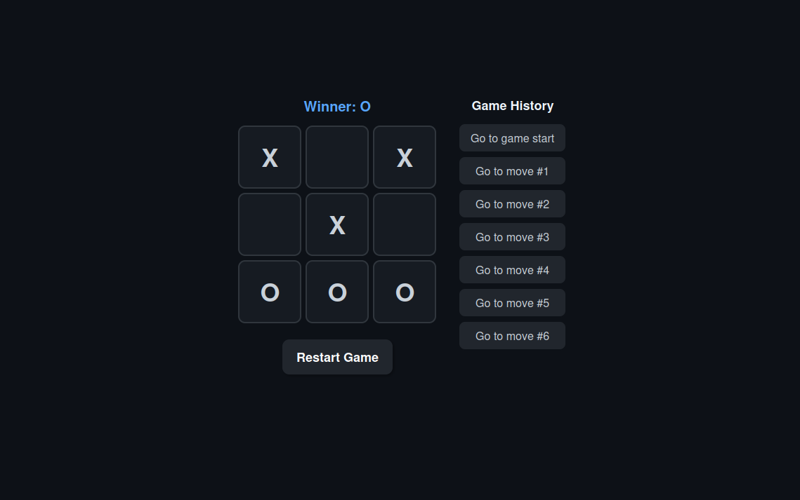

# X's and O's

<div align="center">
  
</div>

## Tabla de contenidos

- [Requisitos](#requisitos)
- [Estructura del proyecto](#estructura-del-proyecto)
- [Puesta en marcha](#puesta-en-marcha)


## Requisitos

* **Node.js:** v18 o superior
* **npm**
* **Expo CLI** (`npm install -g expo-cli`) — opcional si usas `npx`


## Estructura del proyecto

```
tictactoe
├── app
│   └── index.tsx
├── app.json
├── assets                                  # Recursos gráficos
│   └── images
│       ├── favicon.png
│       └── icon.png
├── eslint.config.js
├── expo-env.d.ts
├── package.json                            # Dependencias y scripts
├── package-lock.json
├── src
│   ├── components                          # Componentes reutilizables (button, board, etc.)
│   │   ├── Board.tsx
│   │   ├── ResetButton.tsx
│   │   └── Square.tsx
│   ├── Game.tsx
│   ├── styles                              # Estilos globales
│   │   └── GlobalStyles.tsx
│   └── utils
│       └── calculateWinner.tsx
└── tsconfig.json                           # Configuración y alias de TypeScript
```


## Puesta en marcha

1. Install dependencies

```bash
  npm install
```

2. Navega al directorio del proyecto:

```bash
  cd tictactoe
```

3. Start the app

```bash
  npx expo start
```

4. Desde la interfaz de **Expo**, abre la app en:

* **iOS:** presiona `i` para abrir el simulador.
* **Android:** presiona `a` o escanea el QR con **Expo Go**.
* **Web:** selecciona la opción `w`.